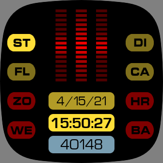
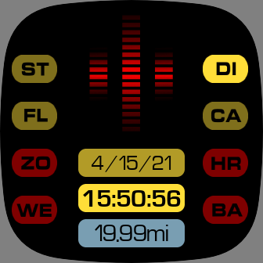

# Fitbit-KITT

This clock face is for people who remember the 80s TV show *Knight Rider* and attempts to replicate the voice box display of the Knight Industries Two-Thousand (KITT) car. It isn't particularly practical, or easy to read, but I hope it makes you smile.

The buttons down the sides change the stats shown in the bottom blue box, and are as follows:
* ST : Steps (count)
* DI : Distance (miles)
* FL : Floors (count)
* CA : Calories (count)
* ZO : Active Zone Minutes (count)
* HR : Heart Rate (bpm)
* WE : Weather (shows current temperature only - F/C selectable in settings)
* BA : Battery (%)

Tapping anywhere on the three center boxes (date, time, stats) cycles through the eight stats options above.

Tapping the red voice indicator takes you to an alternate, somewhat easier to read view. The battery level is represented by an image resembling the scanner on the front of the car.

To return to the main display, just tap anywhere on this screen. The voice indicator pulse is currently fixed, and does not represent heart rate, or anything else.
